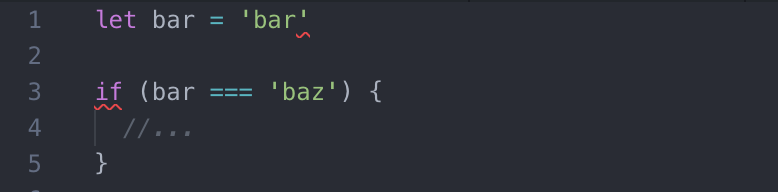
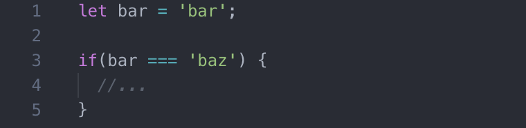

#  eslint 配置 

无规矩不成方圆，项目一大，协作人员一多，就需要一套规则来约束各个开发人员的代码风格。不仅有利于 code review ，也能避免一些编程上的低级 bug。

下面讲解在 vscode 下配置 eslint 和 tslint，让 vscode 自动帮我们格式化代码。

### eslint

ESLint是一个开源JavaScript linting实用程序，最初由Nicholas C. Zakas于2013年6月创建。代码linting是一种静态分析，经常用于查找不符合某些样式指南的有问题的模式或代码。JavaScript 是动态类型语言，需要在运行时才能知道语法错误，而 ESLint 能对 JavaScript 做静态分析，在不运行 JavaScript 的情况下分析出代码问题。

#### 开始

首先需要装 eslint ，可装在全局或当前工程目录下。

```
npm i -g eslint
```

配置一个独立的 .eslintrc.* 文件，或者直接在 package.json 文件里的 eslintConfig 字段指定配置，ESLint 会查找和自动读取它们，再者，你可以在命令行运行时指定一个任意的配置文件。

一般我们在当前工程下建个 .eslintrc.js 配置文件， 如下：

```
├──  .eslintrc.js   
├──  app.js 
```

其中 app.js 我们简单写个脚本

```
let bar = 'bar'

if (bar == 'baz') {
  //...
}
```

接着试着在控制台运行 eslint : `eslint app.js`

不出意外的话，我们控制台会报以下错误：

```
1:5  error  Parsing error: Unexpected token bar
✖ 1 problem (1 error, 0 warnings)
```

我们 .eslintrc.js  啥规则都没配，为啥就报错了呢？那是默认情况下，ESLint 支持 ECMAScript 5 语法。而我们 app.js 用到了ES6的语法，所以报错了。

接着我们就来详解 .eslintrc.js 的具体配置，来满足我们想要的语法校验规则


#### .eslintrc.js 配置

基本配置项：

```
module.exports = {
  "parserOptions": {  
  },
  "parser": "",
  "env": {},
  "globals": {},
  "plugins": [],
  "rules": {},
  "settings": {},
  "extends": "",
}
```

##### 1、parserOptions

```
"parserOptions": {
  "ecmaVersion": 6, // 默认设置为3，5（默认）， 你可以使用 6、7、8 或 9 来指定你想要使用的 ECMAScript 版本。
  "sourceType": "module", // 设置为 "script" (默认) 或 "module"（如果你的代码是 ECMAScript 模块)
  "ecmaFeatures": { // 这是个对象，表示你想使用的额外的语言特性
      "jsx": true
  }
}
```

一般我们对这项使用的配置为：

```
"parserOptions": {
  "sourceType": "module"
}
```

##### 2、parser

指定 Eslint 的解析器，默认的解析器是 esprima ，我们可以自己指定不同的解析器，如 babel-eslint ，@typescript-eslint/parser 。
注意解析器是一个 npm module，使用指定的解析器时，我们本地需要 install 对应的 module 。如：

```
// npm i babel-eslint -D
"parser": "babel-eslint"
```

这时我们的 .eslintrc.js 配置如下：

```
module.exports = {
  "parserOptions": {  
    "sourceType": "module"
  },
  "parser": "babel-eslint"
}
```
我们再次运行 `eslint app.js` 发现控制台不会报错了，因为我们配置了对应的解析器，babel-eslint 支持了 es6的解析，所以不会报错了。

##### 3、env

一个环境定义了一组预定义的全局变量。一般用到的有

```
"env": {
  "browser": true,
  "node": true,
  "jest": true,
  "amd": true
}
```

##### 4、globals

当访问当前源文件内未定义的变量时，no-undef 规则将发出警告。则可通过 globals 配置

```
"globals": {
  "var1": true, // true 将允许变量被重写
  "var2": false // 或 false 将不允许被重写
}
```

##### 5、plugins

Eslint 默认只支持 .js 文件的检查，校验其他类型文件需要装载对应的 plugins ，如 eslint-plugin-html， eslint-plugin-vue， eslint-plugin-react 。

```
"plugins": [
  "html", // 可省略 eslint-plugin-
  "vue"
]
```
但有一点需要注意的是，由于 Node.js 的 require 函数的行为，ESLint 加载 plugins 只相对于 ESlint 所在的 module 路径，所以如果刚才 ESLint 是全局安装，对应加载的路径也需要全局。或者把 ESLint 和 plugin 都装在本地。


##### 6、rules

rules 这个配置项就不陌生了，我们可以在这个配置项添加我们想要的配置规则，这里有一份官方的规则列表 [eslint-rules](http://eslint.cn/docs/rules/) ，下面我给出一份简单的我在项目中常用的规则列表：

```
rules: {
  semi: [2, 'always'],
  // http://eslint.org/docs/rules
  quotes: [2, 'single', 'avoid-escape'],
  // http://eslint.org/docs/rules/no-unused-vars
  'no-unused-vars': [
      1, { vars: 'local', args: 'after-used' }
  ],
  'eol-last': 1,
  'no-debugger': 1,
  'padded-blocks': 1,
  'brace-style': [2, 'stroustrup'],
  'comma-dangle': [2, 'only-multiline'],
  'space-before-function-paren': [2, 'never'],
  'no-multiple-empty-lines': [2, { max: 3 }],
  'keyword-spacing': [
      2, {
          before: true,
          after: true,
          overrides: {
              'catch': {
                  after: false
              },
              'for': {
                  after: false
              },
              'if': {
                  after: false
              },
              'while': {
                  after: false
              }
          }
      }
  ],
  indent: [2, 2, {
      MemberExpression: 0
  }],
  eqeqeq: 2,
  curly: 1
}
```

校验规则非常多，大家可对照文档配置

比如这条：
```
// 是否在代码中存在 console
// "off" 或 0 - 关闭规则
// "warn" 或 1 - 开启规则
// "error" 或 2 - 开启规则

"no-console": "warn"
```

有比如：

```
// 使用单引号，错误级别为 error 
quotes: [2, 'single', 'avoid-escape'],
```

更多规则查看官方文档 [eslint-rules](http://eslint.cn/docs/rules/)


##### 6、settings

共享配置，比如我们上面装了一个 eslint-plugin-html 插件，作用于 html ，我们可以使用 settings ，将插件也作用于不同的文件，比如：

```
settings: {
  'html/html-extensions': ['.html', '.vue'] // 作用于 .html 和 .vue
}
```

##### 7、extends

继承，扩展。我们可以对原有的规则进行扩展，比如：

```
extends: 'standard',
rules: {
  //...
}
```

我们在 standard 的基础上扩展我们自己的 rules 规则。 standard 是 eslint 的基础配置


#### 结合 vscode 进行代码校验提醒

上面虽然配置了 eslint 规则，但每次我们都需要执行 `eslint app.js` 手动校验，检验完再做修改，难免太麻烦。好在我们有 vscode 可以帮我们执行校验，并做代码提醒，我们只需要做简单配置，就可以边写代码，边做eslint校验了，而且还能在保存代码的时候顺便帮我们按照校验规则格式化代码，大大提高了编程效率。

让 vscode 自动帮我们做代码校验和格式化，我们需要扩展 vscode 插件，并做相应配置


安装 ESLint 插件，并在 vscode 的 settings.json 做如下配置

```
"eslint.options": {"configFile": ""},
"eslint.autoFixOnSave": true,
"eslint.validate": [
  "javascript",
  "javascriptreact",
  "html",
  {
    "language": "vue",
    "autoFix": true
  }
],
```

其中 autoFixOnSave 开发保存自动格式化代码，validate 及校验对应文件类型。

重启 vscode ，这时 vscode 代码就可以有错误信息提示了



编辑保存代码后就会按 rules 自动格式化代码并修复 bug




### 小结

工欲善其事，必先利其器，一份好用 eslin 配置能让你的代码更加工整规范，也有助于项目的协作开发。