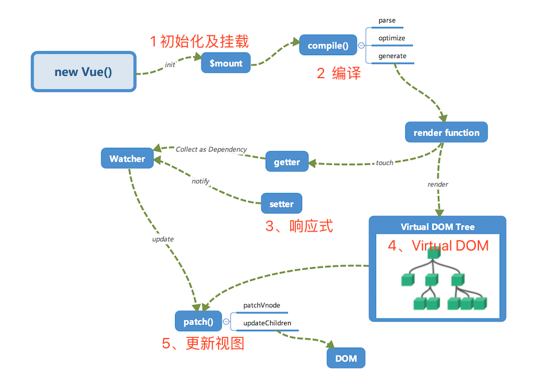

# Vue.js内部运行机制浅解

## 一、内部流程图



### 1、初始化及挂载

在 new Vue() 之后。 Vue 会调用 _init 函数进行初始化，也就是这里的 init 过程，它会初始化生命周期、事件、 props、 methods、 data、 computed 与 watch 等。其中最重要的是通过 Object.defineProperty 设置 setter 与 getter 函数，用来实现「响应式」以及「依赖收集」。

### 2、编译

compile编译可以分成 parse、optimize 与 generate 三个阶段，最终需要得到 render function。

> parse

parse 会用正则等方式解析 template 模板中的指令、class、style等数据，形成AST。

> optimize

optimize 的主要作用是标记 static 静态节点，这是 Vue 在编译过程中的一处优化，后面当 update 更新界面时，会有一个 patch 的过程， diff 算法会直接跳过静态节点，从而减少了比较的过程，优化了 patch 的性能。

> generate

generate 是将 AST 转化成 render function HTML字符串的过程，得到结果是 render 的字符串以及 staticRenderFns 字符串。

在经历过 parse、optimize 与 generate 这三个阶段以后，组件中就会存在渲染 VNode 所需的 render function 了。

### 3、响应式

响应式部分会对数据进行响应式响应和依赖收集

### 4、Virtual DOM

render function 会被转化成 VNode 节点。Virtual DOM 其实就是一棵以 JavaScript 对象（ VNode 节点）作为基础的树，用对象属性来描述节点，实际上它只是一层对真实 DOM 的抽象。

如下面的例子：

```
{
    tag: 'div',                 /*说明这是一个div标签*/
    children: [                 /*存放该标签的子节点*/
        {
            tag: 'a',           /*说明这是一个a标签*/
            text: 'click me'    /*标签的内容*/
        }
    ]
}
```

渲染后可以得到

```
<div>
    <a>click me</a>
</div>
```

### 5、更新视图

更新视图可不是简单粗暴的得到一个新的VNode 节点，然后用 innerHTML 直接全部渲染到真实 DOM 中。但是其实我们只对其中的一小块内容进行了修改，这样做似乎有些「浪费」。「patch」就是对更新视图做了优化。我们会将新的 VNode 与旧的 VNode 一起传入 patch 进行比较，经过 diff 算法得出它们的「差异」。最后我们只需要将这些「差异」的对应 DOM 进行修改即可。

## 二、响应式系统的基本原理


## 三、响应式系统的依赖收集追踪原理