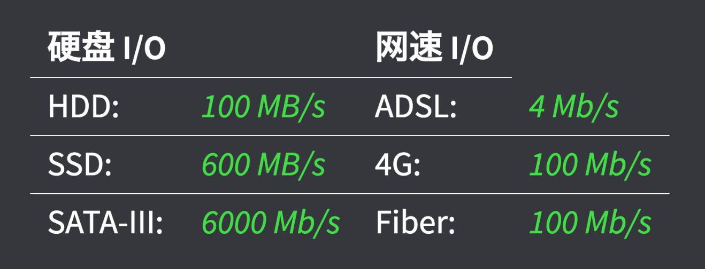
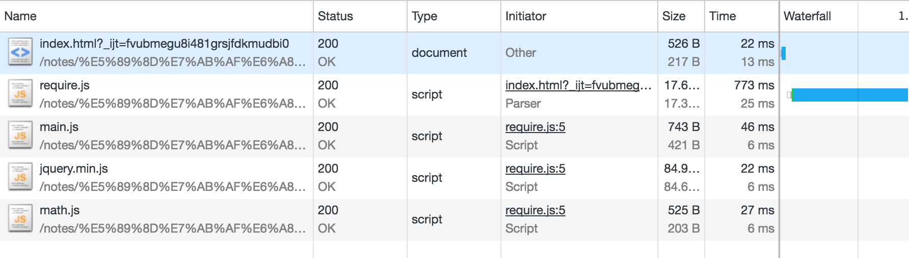
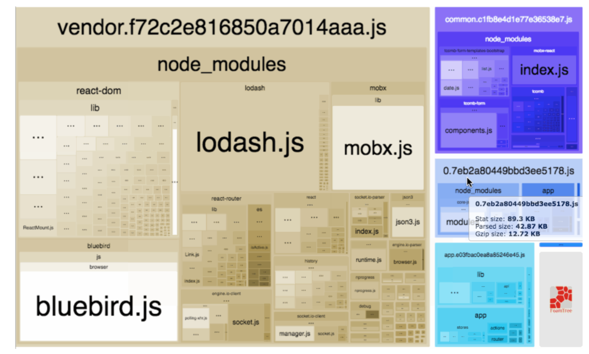

# 前端模块化

### 1、石器时代
- 以前我们是这么写代码的：
```
function foo(){
    //...
}
function bar(){
    //...
}
```
都知道这样会造成变量的全局污染，变量名冲突

- 后来我们做了改进：

```
var Module = (function($){
    var _$body = $("body");     // we can use jQuery now!
    var foo = function(){
        console.log(_$body);    // 特权方法
    }
    // Revelation Pattern
    return {
        foo: foo
    }
})(jQuery)

Module.foo();
```
利用匿名闭包的模式包裹变量，并暴露一些公共方法，还可以引入依赖 `jQuery`,
也就是所谓的 `模块模式` ， 是现代模块实现的基石

- 虽然做了模块化封装，但还不够

现实项目中我们往往需要加载多个脚本
```
   script(src="zepto.js")
   script(src="jhash.js")
   script(src="fastClick.js")
   script(src="iScroll.js")
   script(src="underscore.js")
   script(src="handlebar.js")
   script(src="datacenter.js")
   script(src="deferred.js")
   script(src="util/wxbridge.js")
   script(src="util/login.js")
   script(src="util/base.js")
   script(src="util/city.js")
   script(src="util/date.js")
   script(src="util/cookie.js")
   script(src="app.js")
```
项目脚本的加载，弊端是
难以维护，需要顺序执行，依赖模糊，请求过多

### 2、模块时代的到来 ： CommonJS 规范
跳出浏览器，CommonJS 是以在浏览器环境之外构建 JavaScript 生态系统为目标而产生的项目，
比如在服务器 node 环境中

模块的定义和使用

```
// math.js
exports.add = function(a, b) {
  return a + b;
};
-----------------------------------
// main.js
var math = require('./math.js');
math.add(111,222); // 333
------------------------------------
// node  main.js  执行
```
或许你可能在别的地方看到 `module.exports` 的方式来导出模块，`module.exports` 是什么玩意儿？
`exports` 只是 `module.exports` 的辅助方法，`exports` 所做的事情是收集属性，可以把 `exports` 看成一个
空对象 `exports.add = function(a, b) {}` 就是对象上定义 add() 方法，最终把收集的属性赋值
给 `module.exports` ，如果文件中存在 `module.exports` 赋值，那么将会忽略掉 `exports`收集的属性

例子：
```
// math2.js
var math2 = function() {
  this.add = function(a, b) {
    return a + b;
  };
  this.minus = function(a, b) {
    return a - b;
  };
};
// add方法 会被忽略
exports.add = function(a, b) {
  return a + b;
};
module.exports = new math2();
-----------------------------------
// main.js
var math2 = require('./math2.js');
math2.add(444,111); // 555
```

### 3、浏览器端的模块 ：AMD、CMD
CommonJS 规范不适合浏览器开发， CommonJS 规范的模块加载是同步的，阻塞的，而浏览器通过网络加载模块，网速不行的话就将阻止模块的加载以及后面功能的运行。但服务端使用CommonJS 规范为什么就行呢？

因为服务端加载脚本是从磁盘硬件上读取的,下图可以看出：
同步加载对 服务器/本地环境 不是问题，浏览器环境才是问题



（1）、浏览器模块化方案： AMD

`例子看项目目录： /前端模块化/AMD`

`RequireJS` 是一个工具库，是 `AMD规范` (Asynchronous Module Definition)的实现者。或许会把 `RequireJS` 和 `AMD规范`混为一谈，AMD只是一种规范，定义异步模块的加载规则，而 `RequireJS` 是脚本代码，这套异步加载规则的实现代码。
下面一个例子利用 RequireJS 来实现 AMD规范

> index.html

引入 require.js 设置 data-main 属性（用来指定网页程序的主模块），该属性会去加载对应目录下的 main.js
```
<script src="./lib/require.js" data-main="./main"></script>
```
> main.js

`require.config` 配置需要加载的模块名和对应的加载路径

```
require.config({
    paths: {
        "jquery": "./lib/jquery.min",
        "math": './src/math',
        "add50": './src/add50'
    }
});

require(['jquery','math'], function ($,math){
    console.log('start main.js ...✈️')
    console.log(math.add(1,1))
    $('#j_ptext').css('color','red')
});
```
其中对模块的加载和执行顺序官方有做一下解释

>The RequireJS syntax for modules allows them to be loaded as fast as possible,
 even out of order, but evaluated in the correct dependency order,
 and since global variables are not created,
 it makes it possible to load multiple versions of a module in a page.

 意思是模块是异步加载且不按顺序的，例如上面的 'jquery','math' 模块不必按书写顺序依次加载，但
 执行顺序是按书写顺序来的，也就是 'jquery','math' 模块加载完，jquery 模块先执行

> math.js

`define` 定义一个待加载的模块
```
define(function (){
    console.log('start math.js ...🚘')
    var add = function (x,y){
        return x+y;
    };
    return {
        add: add
    };
});
```
如果定义的模块有依赖其他模块，添加第一个形参为模块名，如下面模块依赖了math模块
```
define(['math'],function (math){
    var add50 = function (x){
        return math.add(x, 50)
    };
    return {
        add50: add50
    };
});
```
可以打开 Chrome 控制台，查看 Network 目录，看的出这些模块是通过 GET 网络请求按需加载的。而且 Type 类型是 script ，相当于加载一段脚本代码，脚本代码加载完会立即执行，这一点可以等下和 CMD规范 做过比较



（2）、浏览器模块化方案： CMD

`例子看项目目录： /前端模块化/CMD`

CMD规范（Common Module Definition）同样也有对应的实现代码，那就是SeaJS ，SeaJS的作者是淘宝前端大牛玉伯，SeaJS 定义模块的风格跟 CommonJs 比较像

例子：

> index.html

引入 sea.js ，定义 config 并配置入口文件 seajs.use
```
<script src="./lib/sea.js"></script>
<script type="text/javascript">
    // seajs 的简单配置
    seajs.config({
        base: "./",
        alias: {
            "jquery": "lib/jquery.min.js"
        }
    })
    // 加载入口模块
    seajs.use("./main")
</script>
```

> main.js

```
// 所有模块都通过 define 来定义
define(function(require, exports, module) {
    console.log('start main.js ...✈️')
    // 通过 require 引入依赖
    require('jquery');
    $('#j_ptext').css('color','red')

    var math = require('./src/math');
    console.log(math(2,9))
});
```

> math.js

```
define(function(require, exports, module) {
    console.log('start math.js ...🚘')
    var add = function (x,y){
        return x+y;
    };
    // 或者通过 module.exports 提供整个接口
    module.exports = add
});
```

##### 浏览器模块化方案 小结：
为什么会出现 AMD规范 和 CMD规范 呢，出现就有他们的道里，下面对 AMD规范 和 CMD规范 做个比较，
或者说是两种规范的实现方式进行比较
SeaJs 和 RequireJS 的异同：下面是 玉伯 在知乎的回答，查阅详情的点击👇链接

>作者：玉伯
链接：https://www.zhihu.com/question/20342350/answer/14828786
来源：知乎
著作权归作者所有。商业转载请联系作者获得授权，非商业转载请注明出处。

再补充一点异同是 `SeaJS对模块的态度是懒执行, 而RequireJS对模块的态度是预执行` 链接专业术语较多，补充的这一点是两种模块最主要的区别之一
RequireJS 是这么去加载依赖的，及所谓的依赖前置，导致的结果就是例子中的依赖 `jquery` 和 `math` 会先加载并执行，接着猜执行
`console.log('start main.js ...✈️')`
```
require(['jquery','math'], function ($,math){
    console.log('start main.js ...✈️')
});
```
而 SeaJS 是依赖后置,它会先执行 `console.log('start main.js ...✈️')` 再去加载依赖，接着再执行依赖
```
define(function(require, exports, module) {
    console.log('start main.js ...✈️')
    // 通过 require 引入依赖
    require('jquery');
});
```

### 4、UMD : 统一写法

既然CommonJs和AMD风格一样流行，似乎缺少一个统一的规范。所以就产生了这样的需求，希望有支持两种风格的“通用”模式，
于是通用模块规范（UMD）诞生了。
下面这种写法它兼容了AMD和CommonJS，同时还支持老式的“全局”变量规范：

```
JavaScript

(function (root, factory) {
    if (typeof define === 'function' && define.amd) {
        // AMD
        define(['jquery', 'underscore'], factory);
    } else if (typeof exports === 'object') {
        // Node, CommonJS之类的
        module.exports = factory(require('jquery'), require('underscore'));
    } else {
        // 浏览器全局变量(root 即 window)
        root.returnExports = factory(root.jQuery, root._);
    }
}(this, function ($, _) {
    //    方法
    function a(){};    //    私有方法，因为它没被返回 (见下面)
    function b(){};    //    公共方法，因为被返回了
    function c(){};    //    公共方法，因为被返回了

    //    暴露公共方法
    return {
        b: b,
        c: c
    }
}));
```

### 5、王者归来 ：ES6 module

有了 UMD 来统一规范，但始终不是正规军，缺乏官方支持。

ES6 统一了模块规范

```
// math.js
export default math = {
    PI: 3.14,
    foo: function(){}
}
// app.js
import math from "./math";
math.PI
```
but ，，这种模块化方式太先进了，浏览器不支持 😢 ， 好在有了 bable ，配合 webpack 完美解决前端模块化

### 6、送你上天 ：webpack 模块打包器(module bundler)

#### (1)、基础
webpack 的基础配置就不写了，可以稍微看一下经过下面 loader 处理后文件的输出情况
```
test: /\.js$/,
use: {
    loader: "babel-loader",
     options: {
          presets: [
              "es2015"
          ]
     }
},
```

其中需要 loader 的 app.js 只有一个log

```
// app.js
console.log('.....app.js.......');
```

输出（内容较多，伪代码如下）：

```
(function (modules) {
    function __webpack_require__(moduleId) {
    	modules[moduleId].call(module.exports, module, module.exports, __webpack_require__);
    }
    return __webpack_require__(__webpack_require__.s = 0);
})([
    function(module, exports, __webpack_require__) {
        "use strict";
        console.log('.....app.js.......');
    }
])
```
将模块打包成一个 function ，再利用 js 立即执行函数 去执行 function模块

#### （2）、打包各种规范模块

用 webpack 分别打包 AMD 、CMD 、commonjs 和 es6 方式 export 出的模块

下面只是代码片段，例子请看项目 `/前端模块化/Webpack/demo1`
```
import amd from './src/module_amd'
import cmd from './src/module_cmd'
import commonjs from './src/module_commonjs'
import es6 from './src/module_es6'

console.log(amd)        // object
console.log(cmd)        // object
console.log(commonjs)   // object
console.log(es6)        // object

amd.add(11,22)        //33
cmd.add(11,22)        //33
commonjs.add(11,22)   //33
es6.add(11,22)        //33
```
看出无论用哪种方式定义模块，都能利用 import 进行模块的引入，这得力于 bable-loader，让
我们在写代码时统一了规范

> 接下去几点是 webpack 结合实际项目，对前端模块化的优化处理

#### （3）、对模块进行提取 CommonsChunkPlugin
有时候我们往往会对一些公共模块或工具方法提取成一个单独的模块，而不是都打到一个包里面，每个页面都加载这么大一个包显然是影响性能的。对于这个需求我们可以用 CommonsChunkPlugin 插件来实现，CommonsChunkPlugin相关配置如下
- 情况1

```
entry: {
     app: './app.js'
},

new webpack.optimize.CommonsChunkPlugin({
     name: 'vendor',       // 上面 entry 入口定义的节点组
     filename:'vendor.js'  //最后生成的文件名，随意
}),
```
当 webpack 的 entry 入口只有一个文件的时候，利用 CommonsChunkPlugin 提取出的只是
webpack的运行文件

- 情况2

```
entry: {
     app: './app.js',
     vendor: ['./src/a.js'] // 指定公共模块
},

new webpack.optimize.CommonsChunkPlugin({
     name: 'vendor',       // 上面 entry 入口定义的节点组
     filename:'vendor.js'  //最后生成的文件名，随意
}),
```
当 webpack 的 entry 入口有多个时，CommonsChunkPlugin 的 name 参数指向 entry 对应的 key，
key 指向的文件会被全局提出出来，并和`webpack的运行文件`打成一个 vendor 包

更多情况可点击链接 [☞ 链接]（https://segmentfault.com/q/1010000009070061/a-1020000009073036）


#### （4）、 .babel 配置
我们经常将 webpack 下对 babel-loader 的 options 配置单独提取出来配置到 .babelrc 文件下
```
{
    test: /\.js$/,
    use: {
         loader: "babel-loader",
      // options: {  // 此处配置可以写到 .babelrc 文件下
      //     presets: [
      //         "es2015"
      //     ]
      // }
    },
    exclude: /node_modules/
}
```
如下文件
```
{
  "presets": [
    "es2015",  // ES2015转码规则  babel-preset-es2015
    "stage-2"  // ES7不同阶段语法提案的转码规则（共有4个阶段），选装一个  babel-preset-stage-2
  ],
  "plugins": ["transform-remove-console"]
}
```
这里简要解释一下 presets 和 plugins 参数。plugins 就是配置语法转换的插件，比如
对 ES6 转换的插件有：
```
transform-es2015-destructuring // 编译解构赋值
transform-es2015-arrow-functions // 编译箭头函数
transform-regenerator // 编译generator函数
// ... 等等
```
那需要对项目做 ES6 语法的转换是不是就应该对 .babelrc 文件 这边配置呢
{
  "plugins": ["transform-es2015-destructuring",
               "transform-es2015-arrow-functions",
               "transform-regenerator",
               "..."]
}
这多麻烦呀，所以也就有了 presets(预设) 配置,如下面配置就将 ES6 转 ES5 ，
也就可以看出了，preset 是一系列 plugin 的集合
```
{
  "presets": [
    "es2015",  // ES2015转码规则  babel-preset-es2015
  ]
}
```
回过头来解释一下下面 .babelrc 配置的意思
对 js 进行 "es2015" 的语法转换，stage-x 代表着支持es6哪个阶段的语法，并添加一个将
转换后的代码进行 console 的 remove 操作，也就是插件 `"plugins": ["transform-remove-console"]`
的作用啦

```
// webpack 1.x
{
  "presets": [
    "es2015",  // ES2015转码规则  babel-preset-es2015
    "stage-2"  // ES7不同阶段语法提案的转码规则（共有4个阶段），选装一个  babel-preset-stage-2
  ],
  "plugins": ["transform-remove-console"]
}
```
不过还有一点是，上面的写法是配合 webpack 1.x 的写法，现在 webpack 2.x 的写法如下
（提醒：需要多装个npm包 `npm i babel-preset-env--save-dev`）
```
// webpack 2.x
{
  "presets": [
    ["env", {
        "modules": false,
        "targets": {
        "chrome": 52,
        "browsers": ["last 2 versions","safari 7"]
        }
    }],
    "stage-2"
  ]
}
```
也就是不配置 "es2015" 选项了，而是通过 env 配置，动态指定 js 转化的版本，而不是固定写死 "es2015"，
因为有的项目不需要将 js 转化到 "es2015" 这么低的版本，而是通过你项目需要支持的浏览器版本就行，比如
"chrome": 52 等。 `"modules": false` 意思是不使用 bable 语法对AMD、CommonJS、UMD之类的模块进行
转化，而是用 webpack2.x 已经把这个事情做了

#### （5）、Tree Shaking 对模块方法进行按需加载
有这么一个文件
```
// src/math.js
export function square(x) {
  return x * x;
}

export function cube(x) {
  return x * x * x;
}
```
下面文件只引用 math.js 下的 cube 方法
```
// index.js
+ import { cube } from './math.js';
cube(10)
```
打包后: 发现 square 方法实际上是没被用到的，但却被打包进来了
```
/* 1 */
/***/ (function(module, __webpack_exports__, __webpack_require__) {

"use strict";
/* unused harmony export square */
/* harmony export (immutable) */ __webpack_exports__["a"] = cube;
function square(x) {
  return x * x;
}

function cube(x) {
  return x * x * x;
}
```
优化：
webpack 2.0 集成了 tree shaking 功能，用于移除 JavaScript 上下文中的未引用代码(dead-code），
但我们还需要做些配置才能达到这效果：
对 .babelrc 加入 {'modules': false} 配置
```
presets: ['es2015', {'modules': false}]
```
对 webpack.config.js 加入 UglifyJSPlugin 配置
```
const UglifyJSPlugin = require('uglifyjs-webpack-plugin');
plugins: [
   new UglifyJSPlugin()
]
```
接着再次打包就看到 代码不仅被压缩，且也没有 square 相关方法了

#### （6）、webpack-bundle-analyzer 模块包树状图
[webpack-bundle-analyzer](https://github.com/webpack-contrib/webpack-bundle-analyzer)
可以用于 webpack 打包后对各个模块进行图形分析，查看 chunk 设置的是否合理等

再附上一篇实战篇 [☞ 链接](https://github.com/Pines-Cheng/blog/issues/4)

### 小结：
前端模块化的前世今生就分析到这里。Brendan Eich（JavaScript的作者）花了10天时间创造出了 JavaScript，由于设计时间太短，语言的一些细节考虑得不够严谨，也没有模块化这么一说，才有了后来的一些开发人员为符合工程化需求定义了一些模块化规范，但始终不是官方出品，好在有了 ES6 ，统一了模块化规范
