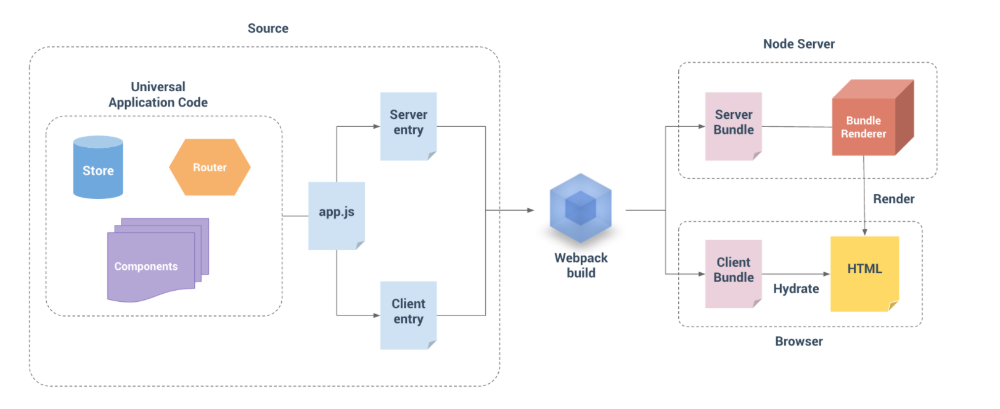

## 服务端渲染（SSR）
什么是服务端渲染，简单理解是将组件或页面通过服务器生成html字符串，再发送到浏览器，最后将静态标记"混合"为客户端上完全交互的应用程序。
于传统的SPA（单页应用）相比，服务端渲染能更好的有利于SEO，减少页面首屏加载时间，当然对开发来讲我们就不得不多学一些知识来支持服务端渲染。同时服务端渲染对服务器的压力也是相对较大的，和服务器简单输出静态文件相比，通过node去渲染出页面再传递给客户端显然开销是比较大的，需要注意准备好相应的服务器负载。

### 一、一个简单的例子

```javascript
// 第 1 步：创建一个 Vue 实例
const Vue = require('vue')
const app = new Vue({
  template: `<div>Hello World</div>`
})
// 第 2 步：创建一个 renderer
const renderer = require('vue-server-renderer').createRenderer()
// 第 3 步：将 Vue 实例渲染为 HTML
renderer.renderToString(app, (err, html) => {
  if (err) throw err
  console.log(html)
  // => <div data-server-rendered="true">Hello World</div>
})
```
上面例子利用 `vue-server-renderer` npm 包将一个vue示例最后渲染出了一段 html。将这段html发送给客户端就轻松的实现了服务器渲染了。

```javascript
const server = require('express')()
server.get('*', (req, res) => {
  // ... 生成 html
  res.end(html)
})
server.listen(8080)
```

### 二、官方渲染步骤

上面例子虽然简单，但在实际项目中往往还需要考虑到路由，数据，组件化等等，所以服务端渲染不是只用一个 `vue-server-renderer` npm包就能轻松搞定的，下面给出一张Vue官方的服务器渲染示意图：



流程图大致意思是：将 Source（源码）通过 webpack 打包出两个 bundle，其中 Server Bundle 是给服务端用的，服务端通过渲染器 bundleRenderer 将 bundle 生成 html 给浏览器用；另一个 Client Bundle 是给浏览器用的，别忘了服务端只是生成前期首屏页面所需的 html ，后期的交互和数据处理还是需要能支持浏览器脚本的 Client Bundle 来完成。

### 三、具体怎么实现

实现过程就是将上面的示意图转化成代码实现，不过这个过程还是有点小复杂的，需要多点耐心去推敲每个细节。

#### 1、先实现一个基本版

项目结构示例：

```
├── build
│   ├── webpack.base.config.js     # 基本配置文件
│   ├── webpack.client.config.js   # 客户端配置文件
│   ├── webpack.server.config.js   # 服务端配置文件
└── src
    ├── router          
    │    └── index.js              # 路由
    └── views             
    │    ├── comp1.vue             # 组件
    │    └── copm2.vue             # 组件
    ├── App.vue                    # 顶级 vue 组件
    ├── app.js                     # app 入口文件
    ├──  client-entry.js           # client 的入口文件
    ├──  index.template.html       # html 模板
    ├──  server-entry.js           # server 的入口文件
├──  server.js           # server 服务
```
其中：

##### （1）、comp1.vue 和 copm2.vue 组件

```JavaScript
<template>
    <section>组件 1</section>
</template>
<script>
    export default {
        data () {
            return {
                msg: ''
            }
        }
    }
</script>
```
##### （2）、App.vue 顶级 vue 组件

```JavaScript
<template>
    <div id="app">
        <h1>vue-ssr</h1>
        <router-link class="link" to="/comp1">to comp1</router-link>
        <router-link class="link" to="/comp2">to comp2</router-link>

        <router-view class="view"></router-view>
    </div>
</template>

<style lang="stylus">
    .link
        margin 10px
</style>
```
##### （3）、index.template.html html 模板

```html
<!DOCTYPE html>
<html lang="zh_CN">
<head>
    <title>{{ title }}</title>
    <meta charset="utf-8"/>
    <meta name="mobile-web-app-capable" content="yes"/>
    <meta http-equiv="X-UA-Compatible" content="IE=edge, chrome=1"/>
    <meta name="renderer" content="webkit"/>
    <meta name="viewport" content="width=device-width, initial-scale=1, maximum-scale=1, user-scalable=no, minimal-ui"/>
    <meta name="theme-color" content="#f60"/>
</head>
<body>
<!--vue-ssr-outlet-->
</body>
</html>
```

##### （4）、上面基础代码不解释，接下来看

路由 router

```javascript
import Vue from 'vue'
import Router from 'vue-router'
import comp1 from '../views/comp1.vue'
import comp2 from '../views/comp2.vue'
Vue.use(Router)
export function createRouter () {
    return new Router({
        mode: 'history',
        scrollBehavior: () => ({ y: 0 }),
        routes: [
            {
                path: '/comp1',
                component: comp1
            },
            {
                path: '/comp2',
                component: comp2
            },
            { path: '/', redirect: '/comp1' }
        ]
    })
}
```
app.js app 入口文件

```javascript
import Vue from 'vue'
import App from './App.vue'
import { createRouter } from './router'

export function createApp (ssrContext) {
    const router = createRouter()
    const app = new Vue({
        router,
        ssrContext,
        render: h => h(App)
    })
    return { app, router }
}
```
我们通过 `createApp` 暴露一个根 Vue 实例，这是为了确保每个用户能得到一份新的实例，避免状态污染，所以我们写了一个
可以重复执行的工厂函数 `createApp`。 同样路由 router 我们也是一样的处理方式 `createRouter` 来暴露一个 router 实例

##### （5）client-entry.js  client 的入口文件

```javascript
import { createApp } from './app'

const { app, router } = createApp()
router.onReady(() => {
    app.$mount('#app')
})
```
客户端代码是在路由解析完成的时候讲 app 挂载到 #app 标签下

##### （7）server-entry.js  server 的入口文件

```javascript
import { createApp } from './app'

export default context => {
    // 因为这边 router.onReady 是异步的，所以我们返回一个 Promise
    // 确保路由或组件准备就绪
    return new Promise((resolve, reject) => {
        const { app, router } = createApp(context)
        router.push(context.url)
        router.onReady(() => {
            resolve(app)
        }, reject)
    })
}
```
服务器的入口文件我们返回了一个 promise

#### 2、打包

在第一步我们大费周章实现了一个带有路由的日常功能模板代码，接着我们需要利用webpack将上面的代码打包出服务端和客户端key的代码，入口文件分别是 `server-entry.js ` 和 `client-entry.js `

##### （1）、 webpack构建配置

一般配置分为三个文件：base, client 和 server。基本配置(base config)包含在两个环境共享的配置，例如，输出路径(output path)，别名(alias)和 loader。服务器配置(server config)和客户端配置(client config)，可以通过使用 webpack-merge 来简单地扩展基本配置。

> webpack.base.config.js 配置文件

``` javascript
const path = require('path')
const webpack = require('webpack')
const ExtractTextPlugin = require('extract-text-webpack-plugin')

module.exports = {
    devtool: '#cheap-module-source-map',
    output: {
        path: path.resolve(__dirname, '../dist'),
        publicPath: '/dist/',
        filename: '[name]-[chunkhash].js'
    },
    resolve: {
        alias: {
            'public': path.resolve(__dirname, '../public'),
            'components': path.resolve(__dirname, '../src/components')
        },
        extensions: ['.js', '.vue']
    },
    module: {
        noParse: /es6-promise\.js$/,
        rules: [
            {
                test: /\.(js|vue)/,
                use: 'eslint-loader',
                enforce: 'pre',
                exclude: /node_modules/
            },
            {
                test: /\.vue$/,
                use: {
                    loader: 'vue-loader',
                    options: {
                        preserveWhitespace: false,
                        postcss: [
                            require('autoprefixer')({
                                browsers: ['last 3 versions']
                            })
                        ]
                    }
                }
            },
            {
                test: /\.js$/,
                use: 'babel-loader',
                exclude: /node_modules/
            },
            {
                test: /\.(png|jpe?g|gif|svg)(\?.*)?$/,
                use: {
                    loader: 'url-loader',
                    options: {
                        limit: 10000,
                        name: 'img/[name].[hash:7].[ext]'
                    }
                }
            },
            {
                test: /\.(woff2?|eot|ttf|otf)(\?.*)?$/,
                use: {
                    loader: 'url-loader',
                    options: {
                        limit: 10000,
                        name: 'fonts/[name].[hash:7].[ext]'
                    }
                }
            },
            {
                test: /\.css$/,
                use: ['vue-style-loader', 'css-loader']
            },
            {
                test: /\.json/,
                use: 'json-loader'
            }
        ]
    },
    performance: {
        maxEntrypointSize: 300000,
        hints: 'warning'
    },
    plugins: [
        new webpack.optimize.UglifyJsPlugin({
            compress: { warnings: false }
        }),
        new ExtractTextPlugin({
            filename: 'common.[chunkhash].css'
        })
    ]
}
```

> webpack.client.config.js 配置文件

```JavaScript
const path = require('path')
const webpack = require('webpack')
const merge = require('webpack-merge')
const base = require('./webpack.base.config')
const glob = require('glob')
const VueSSRClientPlugin = require('vue-server-renderer/client-plugin')

const config = merge(base, {
    entry: {
        app: './src/client-entry.js'
    },
    resolve: {
        alias: {
            'create-api': './create-api-client.js'
        }
    },
    plugins: [
        new webpack.DefinePlugin({
            'process.env.NODE_ENV': JSON.stringify(process.env.NODE_ENV || 'development'),
            'process.env.VUE_ENV': '"client"',
            'process.env.DEBUG_API': '"true"'
        }),
        new webpack.optimize.CommonsChunkPlugin({
            name: 'vendor',
            minChunks: function (module) {
                return (
                    /node_modules/.test(module.context) && !/\.css$/.test(module.require)
                )
            }
        }),
        new webpack.optimize.CommonsChunkPlugin({
            name: 'manifest'
        }),
        // 这是将服务器的整个输出
        // 构建为单个 JSON 文件的插件。
        // 默认文件名为 `vue-ssr-server-bundle.json`
        new VueSSRClientPlugin()
    ]
})
module.exports = config
```

> webpack.server.config.js 配置文件

```javascript
const path = require('path')
const webpack = require('webpack')
const merge = require('webpack-merge')
const base = require('./webpack.base.config')
const nodeExternals = require('webpack-node-externals')
const VueSSRServerPlugin = require('vue-server-renderer/server-plugin')

module.exports = merge(base, {
    target: 'node',
    devtool: '#source-map',
    entry: './src/server-entry.js',
    output: {
        filename: 'server-bundle.js',
        libraryTarget: 'commonjs2'
    },
    resolve: {
        alias: {
            'create-api': './create-api-server.js'
        }
    },
    externals: nodeExternals({
        whitelist: /\.css$/
    }),
    plugins: [
        new webpack.DefinePlugin({
            'process.env.NODE_ENV': JSON.stringify(process.env.NODE_ENV || 'development'),
            'process.env.VUE_ENV': '"server"'
        }),
        new VueSSRServerPlugin()
    ]
})
```

webpack 配置完成，其实东西也不多，都是常规配置。需要注意的是 `webpack.server.config.js` 配置，output是生成一个 commonjs 的 library， `VueSSRServerPlugin` 用于这是将服务器的整个输出构建为单个 JSON 文件的插件。


##### （2）、 webpack build poj

build 代码

```
webpack --config build/webpack.client.config.js
webpack --config build/webpack.server.config.js

```
打包后会生成一些打包文件，其中 server.config 打包后会生成 `vue-ssr-server-bundle.json` 文件，这个文件是给 `createBundleRenderer` 用的,用于服务端渲染出 html 文件

```JavaScript
const { createBundleRenderer } = require('vue-server-renderer')
const renderer = createBundleRenderer('/path/to/vue-ssr-server-bundle.json', {
  // ……renderer 的其他选项
})
```

细心的你还会发现 client.config 不仅生成了一下客服端用的到 js 文件，还会生成一份 `vue-ssr-client-manifest.json` 文件,这个文件是客户端构建清单，服务端拿到这份构建清单找到一下用于初始化的js脚步或css注入到 html 一起发给浏览器。

##### （3）、 服务端渲染

其实上面都是准备工作，最重要的一步是将webpack构建后的资源代码给服务端用来生成 html 。我们需要用node写一个服务端应用，通过打包后的资源生成 html 并发送给浏览器

server.js

```javascript
const fs = require('fs')
const path = require('path')
const Koa = require('koa')
const KoaRuoter = require('koa-router')
const serve = require('koa-static')
const { createBundleRenderer } = require('vue-server-renderer')
const LRU = require('lru-cache')

const resolve = file => path.resolve(__dirname, file)
const app = new Koa()
const router = new KoaRuoter()
const template = fs.readFileSync(resolve('./src/index.template.html'), 'utf-8')

function createRenderer (bundle, options) {
    return createBundleRenderer(
        bundle,
        Object.assign(options, {
            template,
            cache: LRU({
                max: 1000,
                maxAge: 1000 * 60 * 15
            }),
            basedir: resolve('./dist'),
            runInNewContext: false
        })
    )
}

let renderer
const bundle = require('./dist/vue-ssr-server-bundle.json')
const clientManifest = require('./dist/vue-ssr-client-manifest.json')
renderer = createRenderer(bundle, {
    clientManifest
})

/**
 * 渲染函数
 * @param ctx
 * @param next
 * @returns {Promise}
 */
function render (ctx, next) {
    ctx.set("Content-Type", "text/html")
    return new Promise (function (resolve, reject) {
        const handleError = err => {
            if (err && err.code === 404) {
                ctx.status = 404
                ctx.body = '404 | Page Not Found'
            } else {
                ctx.status = 500
                ctx.body = '500 | Internal Server Error'
                console.error(`error during render : ${ctx.url}`)
                console.error(err.stack)
            }
            resolve()
        }
        const context = {
            title: 'Vue Ssr 2.3',
            url: ctx.url
        }
        renderer.renderToString(context, (err, html) => {
            if (err) {
                return handleError(err)
            }
            console.log(html)
            ctx.body = html
            resolve()
        })
    })
}

app.use(serve('/dist', './dist', true))
app.use(serve('/public', './public', true))

router.get('*', render)
app.use(router.routes()).use(router.allowedMethods())

const port = process.env.PORT || 8089
app.listen(port, '0.0.0.0', () => {
    console.log(`server started at localhost:${port}`)
})
```
这里我们用到了最开始 demo 用到的 `vue-server-renderer` npm 包，通过读取 `vue-ssr-server-bundle.json` 和 `vue-ssr-client-manifest.json` 文件 renderer 出 html，最后 `ctx.body = html` 发送给浏览器, 我们试着
`console.log(html)` 出 html 看看服务端到底渲染出了何方神圣：

```HTML
<!DOCTYPE html>
<html lang="zh_CN">
<head>
    <title>Vue Ssr 2.3</title>
    <meta charset="utf-8"/>
    <meta name="mobile-web-app-capable" content="yes"/>
    <meta http-equiv="X-UA-Compatible" content="IE=edge, chrome=1"/>
    <meta name="renderer" content="webkit"/>
    <meta name="viewport" content="width=device-width, initial-scale=1, maximum-scale=1, user-scalable=no, minimal-ui"/>
    <meta name="theme-color" content="#f60"/>
<link rel="preload" href="/dist/manifest-56dda86c1b6ac68c0279.js" as="script"><link rel="preload" href="/dist/vendor-3504d51340141c3804a1.js" as="script"><link rel="preload" href="/dist/app-ae1871b21fa142b507e8.js" as="script"><style data-vue-ssr-id="41a1d6f9:0">
.link {
  margin: 10px;
}
</style><style data-vue-ssr-id="7add03b4:0"></style></head>
<body>
<div id="app" data-server-rendered="true"><h1>vue-ssr</h1><a href="/comp1" class="link router-link-exact-active router-link-active">to comp1</a><a href="/comp2" class="link">to comp2</a><section class="view">组件 1</section></div><script src="/dist/manifest-56dda86c1b6ac68c0279.js" defer></script><script src="/dit/vendor-3504d51340141c3804a1.js" defer></script><script src="/dist/app-ae1871b21fa142b507e8.js" defer></script>
</body>
</html>
```

可以看到服务端把路由下的 `组件 1` 也给渲染出来了，而不是让客服端去动态加载，其次是 html 也被注入了一些 <script 标签去加载对应的客户端资源。这里再多说一下，有的同学可能不理解，服务端渲染不就是最后输出 html 让浏览器渲染吗，怎么 html 还带 js 脚本，注意，服务端渲染出的 html 只是首次展示给用户的页面而已，用户后期操作页面处理数据还是需要 js 脚本去跑的，也就是 webpack 为什么要打包出一套服务端代码（用于渲染首次html用），一套客户端代码（用于后期交互和数据处理用）

### 四、小结

本篇简单了解了 vue ssr 的简单流程，上面例子的demo放在对应项目根目录下，方便查看。服务端渲染还有比较重要的一部分是首屏数据的获取渲染，一般页面展示都会有一些网络数据初始化，服务端渲染可以将这些数据获取到插入到 html ，由于这部份内容涉及到的知识点也不少，放在下次讲。

#### 运行项目

```
npm run install
npm run build:client  // 生成 clientBundle
npm run build:server  // 生成 serverBundle
npm run dev           // 启动 node 渲染服务
```

open http://localhost:8089/
