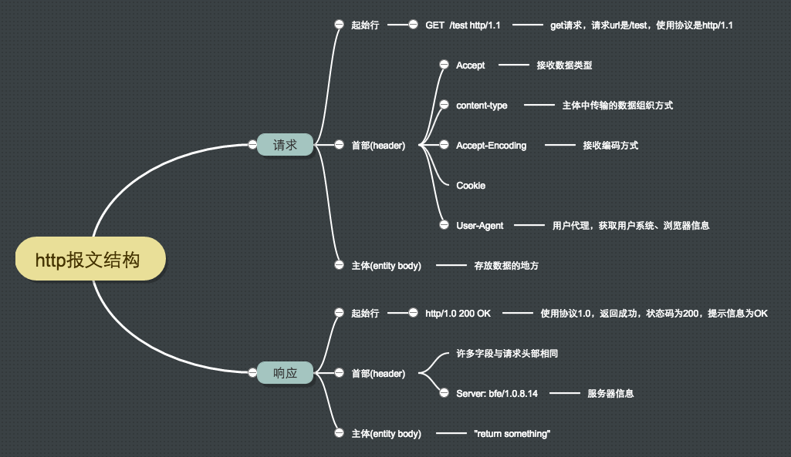
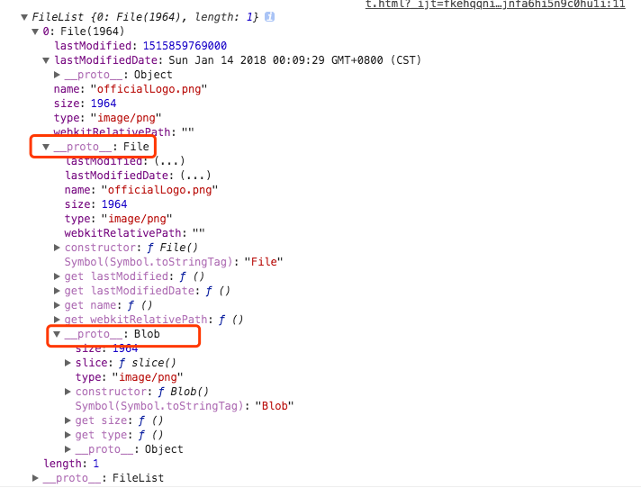
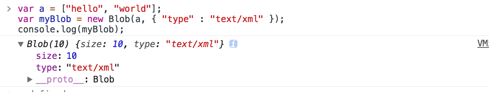
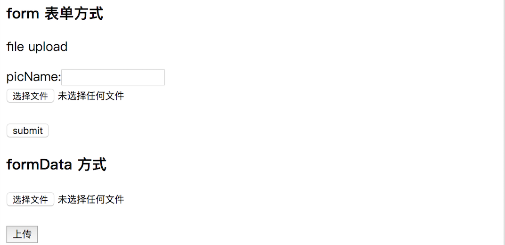

# 浏览器文件上传

最近项目有用到文件上传，发现对这一块内容不是很了解，所以花时间整理一份这方面的知识体系

## 一、预备知识
### 1、HTTP 请求和响应



#### 请求

常见的HTTP请求报文头属性 

> Accept 

请求报文可通过一个“Accept”报文头属性告诉服务端客户端接受什么类型的响应。Accept属性的值可以为一个或多个MIME类型的值，关于MIME类型，大家请参考：http://en.wikipedia.org/wiki/MIME_type 

```$xslt
Accept: application/javascript
Accept: application/json
Accept: application/x-www-form-urlencodedtext/css
Accept: text/htm
Accept: image/pn
Accept: multipart/form-data
// ...
```
> Cookie

客户端的Cookie就是通过这个报文头属性传给服务端的哦！如下所示： 

```$xslt
Cookie: $Version=1; Skin=new;jsessionid=5F4771183629C9834F8382E23BE13C4C  
```
>Cache-Control 

对缓存进行控制，如一个请求希望响应返回的内容在客户端要被缓存一年，或不希望被缓存就可以通过这个报文头达到目的。

```$xslt
Cache-Control: no-cache  // 不缓存
Cache-Control: max-age=600  // 缓存内容将在xxx秒后失效
```


> Content-Type

Content-Type用于指定内容类型，一般是指网页中存在的Content-Type，Content-Type属性指定请求和响应的HTTP内容类型。如果未指定 ContentType，默认为text/html。
常见的 Content-Type 如下：
```$xslt
Content-Type: text/html
Content-Type: text/plain
Content-Type: text/css
Content-Type: text/javascript
Content-Type: application/x-www-form-urlencoded
Content-Type: multipart/form-data
Content-Type: application/json
Content-Type: application/xml
```
Content-Type 是重点，对我们理解数据上传，或文件上传有帮助，下面重点讲一下 Content-Type

application/x-www-form-urlencoded

application/x-www-form-urlencoded是常用的表单发包方式，普通的表单提交，或者js发包，默认都是通过这种方式
比如一个简单的表单提交
```html
<form enctype="application/x-www-form-urlencoded" action="http://homeway.me/post.php" method="POST">
    <input type="text" name="name" value="homeway">
    <input type="text" name="key" value="nokey">
    <input type="submit" value="submit">
</form>
```
请求主体如下：
```$xslt
Accept:text/html,application/xhtml+xml,application/xml;q=0.9,image/webp,*/*;q=0.8
Accept-Encoding:gzip, deflate
Accept-Language:zh-CN,zh;q=0.8,en;q=0.6,zh-TW;q=0.4,gl;q=0.2,de;q=0.2
Cache-Control:no-cache
Connection:keep-alive
Content-Length:17
Content-Type:application/x-www-form-urlencoded
```
那么服务器收到的raw body会是，name=homeway&key=nokey，在php中，通过$_POST就可以获得数组形式的数据。

text/xml
微信用的是这种数据格式发送请求的。
```$xslt
POST http://www.homeway.me HTTP/1.1 
Content-Type: text/xml
<?xml version="1.0"?>
<resource>
    <id>123</id>
    <params>
        <name>
            <value>homeway</value>
        </name>
        <age>
            <value>22</value>
        </age>
    </params>
</resource>
```

multipart/form-data

multipart/form-data用在发送文件的POST包。
通过控制台，可以看到发送一个文件的数据内容如下：
```$xslt
POST http://www.homeway.me HTTP/1.1
Content-Type:multipart/form-data; boundary=------WebKitFormBoundaryOGkWPJsSaJCPWjZP

------WebKitFormBoundaryOGkWPJsSaJCPWjZP
Content-Disposition: form-data; name="key2"
456
------WebKitFormBoundaryOGkWPJsSaJCPWjZP
Content-Disposition: form-data; name="key1"
123
------WebKitFormBoundaryOGkWPJsSaJCPWjZP
Content-Disposition: form-data; name="file"; filename="index.png"
```
这里Content-Type告诉我们，发包是以multipart/form-data格式来传输，另外，还有boundary用于分割数据。
`当文件太长，HTTP无法在一个包之内发送完毕，就需要分割数据，分割成一个一个chunk发送给服务端`，
那么--用于区分数据快，而后面的数据 WebKitFormBoundaryOGkWPJsSaJCPWjZP 就是标示区分包作用。


更多请求报文属性请参考 http://en.wikipedia.org/wiki/List_of_HTTP_header_fields 

#### 响应

常见的HTTP响应报文头属性 

> Cache-Control 

请求报文头也有个 Cache-Control ，请求的 Cache-Control  用于告诉服务器我需要缓存这个请求资源，服务端接受到这个属性后也给客服端响应一个 Cache-Control 属性，通过该报文头属告诉客户端如何控制响应内容的缓存。 
比如设置了 `Cache-Control: max-age=3600  ` 让客户端对响应内容缓存3600秒，也即在3600秒内，如果客户再次访问该资源，直接从客户端的缓存中返回内容给客户，不要再从服务端获取（当然，这个功能是靠客户端实现的，服务端只是通过这个属性提示客户端“应该这么做”，做不做，还是决定于客户端，如果是自己宣称支持HTTP的客户端，则就应该这样实现）。 

> ETag 

一个代表响应服务端资源（如页面）版本的报文头属性，如果某个服务端资源发生变化了，这个ETag就会相应发生变化。它是Cache-Control的有益补充，可以让客户端“更智能”地处理什么时候要从服务端取资源，什么时候可以直接从缓存中返回响应。 

```$xslt
ETag: "737060cd8c284d8af7ad3082f209582d"  
```

> Set-Cookie 

服务端可以设置客户端的Cookie，其原理就是通过这个响应报文头属性实现的： 

```$xslt
Set-Cookie: UserID=JohnDoe; Max-Age=3600; Version=1  

```

### 2、input file 知识
HTML5 添加了一些强大的 File API 

#### FileList
FileList 对象针对表单的 file 控件。当用户通过 file 控件选取文件后，这个控件的 files 属性值就是 FileList 对象。它在结构上类似于数组，包含用户选取的多个文件。如果 file 控件没有设置 multiple 属性，那么用户只能选择一个文件，FileList 对象也就只有一个元素了。

```$xslt
<input type='file' />
<script>
    document.querySelector('input').onchange = function() {
      console.log(this.files);
    };
</script>
```


由控制台可以看到 FileList 是一个数组，数组包含文件的一些信息

### File

我们看到一个 FileList 对象包含了我们选中的 File 对象，那么一个 File 又有哪些属性呢？我们可以打印出来看看。



name：文件名，该属性只读。

size：文件大小，单位为字节，该属性只读。

type：文件的 MIME 类型，如果分辨不出类型，则为空字符串，该属性只读。

lastModified：文件的上次修改时间，格式为时间戳。

lastModifiedDate：文件的上次修改时间，格式为 Date 对象实例。

### Blob

上图中我们看到，File 对象是继承自 Blob 对象的，Blob 又是什么鬼？
Blob（Binary Large Object）对象代表了一段二进制数据，提供了一系列操作接口。其他操作二进制数据的 API（比如 File 对象），都是建立在 Blob 对象基础上的，继承了它的属性和方法。
生成 Blob 对象有两种方法：一种是使用 Blob 构造函数，另一种是对现有的 Blob 对象使用 slice 方法切出一部分。

````$xslt
var a = ["hello", "world"];
var myBlob = new Blob(a, { "type" : "text/xml" });
console.log(myBlob);
````



Blob 对象有两个只读属性：

size：二进制数据的大小，单位为字节。（文件上传时可以在前端判断文件大小是否合适）

type：二进制数据的 MIME 类型，全部为小写，如果类型未知，则该值为空字符串。（文件上传时可以在前端判断文件类型是否合适）

### FileReader

FileReader API 才是我们接下去完成一些任务的关键。FileReader API 用于读取文件，即把文件内容读入内存。它的参数是 File 对象或 Blob 对象。

```$xslt
var reader = new FileReader();
reader.abort();
```

### URL

URL 对象居然也属于File API ，我也很吃惊，不过下面的API估计我们或多或少有用过

```$xslt
var objecturl =  window.URL.createObjectURL(blob);
```

上面的代码会对二进制数据生成一个 URL，这个 URL 可以放置于任何通常可以放置 URL 的地方，比如 img 标签的 src 属性。需要注意的是，即使是同样的二进制数据，每调用一次 URL.createObjectURL 方法，就会得到一个不一样的 URL。
这个 URL 的存在时间，等同于网页的存在时间，一旦网页刷新或卸载，这个 URL 就失效。（File 和 Blob 又何尝不是这样呢）除此之外，也可以手动调用 URL.revokeObjectURL 方法，使 URL 失效。

## 二、文件上传

介绍了那么多，实际用到的知识很少，但有个大概的内容体系才不多对自己写的代码一知半解不是吗。下面我们用个文件上传的demo实际操作一下：

我们用 form 表单和 ajax 方式来分别实现文件上传




```html
    <section>
        <h1>form 表单方式</h1>
        <form method="POST" action="/api/uploadFile" enctype="multipart/form-data">
            <p>file upload</p>
            <span>picName:</span><input name="picName" type="text" /><br/>
            <input name="file" type="file" /><br/><br/>
            <button type="submit">submit</button>
        </form>
    </section>
    <section>
        <h1>formData 方式</h1>
        <input id="J_file_type1" name="file" type="file" /><br/><br/>
        <button id="J_btn_upload_type1">上传</button>
    </section>
```

### 1、form 表单方式
点击页面的 `<button type="submit">submit</button>` 就实现了文件上传。
form 表单设置了 action 上传路径 enctype 上传类型（表现在请求头中）这个在文章的最开始部分咱们也就介绍了就不多说了。
form 表单上传文件有个不好的地方是form 表单提交会刷新页面，也就对用户很不友好了，下面咱们再用 formData 方式 来实现文件上传

### 2、formData 方式

```javascript
        const file = document.querySelector('#J_file_type1').files[0]
        const formData = new FormData()
        // 建立一个upload表单项，值为上传的文件
        formData.append('file', file)
        formData.append('name', file.name)
        const xhr = new XMLHttpRequest()
        xhr.open('POST', '/api/uploadFile')
        // 定义上传完成后的回调函数
        xhr.onload = function () {
            if (xhr.status === 200) {
                alert('上传成功')
            } else {
                alert('出错了')
            }
        }
        xhr.send(formData);
```
这里我们用到了 FormData 来实现文件上传。
FormData对象用以将数据编译成键值对，以便用XMLHttpRequest来发送数据。其主要用于发送表单数据，但亦可用于发送带键数据(keyed data)，而独立于表单使用。如果表单enctype属性设为multipart/form-data ，则会使用表单的submit()方法来发送数据，从而，发送数据具有同样形式。

### 3、如果不使用 formData 方式呢
如果不使用FormData对象的情况下，通过AJAX序列化和提交表单也是可以实现表单上传，不过这也太变态了，因为要自己序列化上面提到的文件上传的请求主体

```$xslt
POST http://www.homeway.me HTTP/1.1
Content-Type:multipart/form-data; boundary=------WebKitFormBoundaryOGkWPJsSaJCPWjZP

------WebKitFormBoundaryOGkWPJsSaJCPWjZP
Content-Disposition: form-data; name="key2"
456
------WebKitFormBoundaryOGkWPJsSaJCPWjZP
Content-Disposition: form-data; name="key1"
123
------WebKitFormBoundaryOGkWPJsSaJCPWjZP
Content-Disposition: form-data; name="file"; filename="index.png"
```
感兴趣的可以点开链接查看 [点开链接查看](https://developer.mozilla.org/en-US/docs/Web/API/XMLHttpRequest/Using_XMLHttpRequest#Submitting_forms_and_uploading_files)

以上demo在[对应文章的目录下](https://github.com/ZengTianShengZ/My-Blog/tree/master/%E6%B5%8F%E8%A7%88%E5%99%A8%E6%96%87%E4%BB%B6%E4%B8%8A%E4%BC%A0%E5%92%8C%E4%B8%8B%E8%BD%BD)

```$xslt
git clone https://github.com/ZengTianShengZ/My-Blog.git
cd 浏览器文件上传/demo/
npm install
node app.js
访问 http://localhost:3000/

```

欢迎交流和指正 😊
