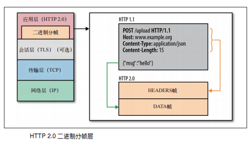
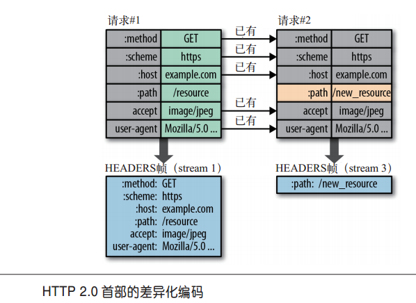
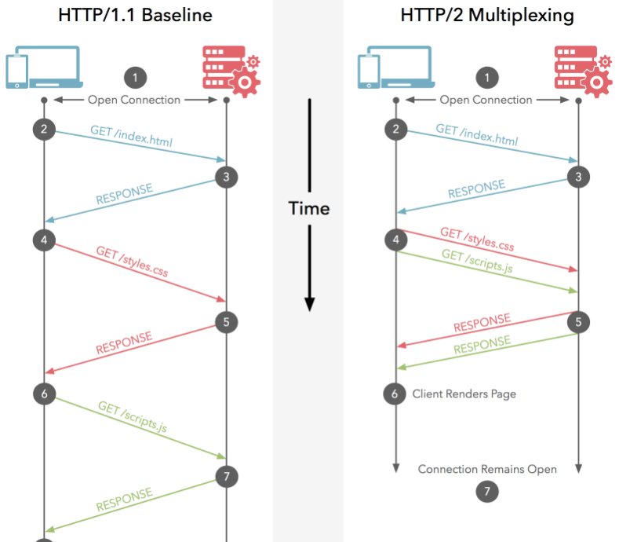
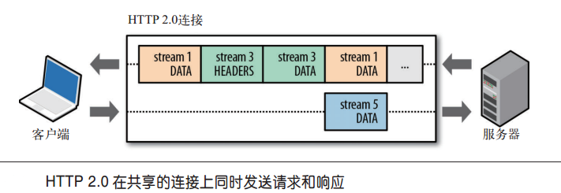
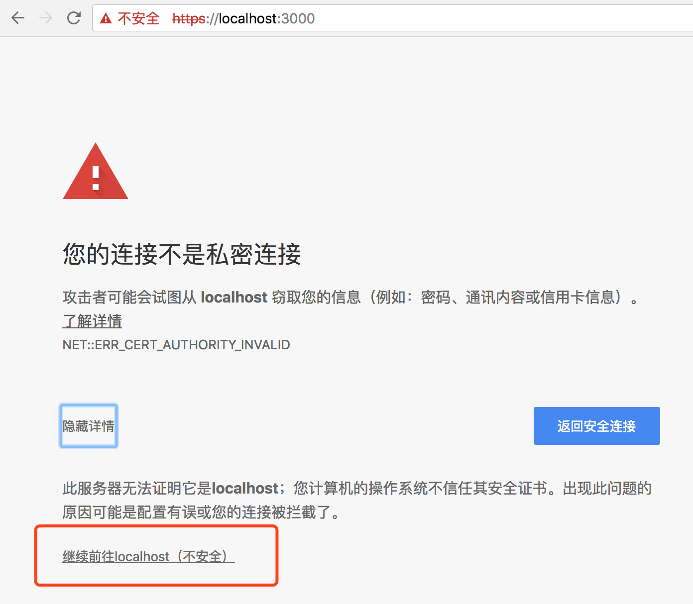
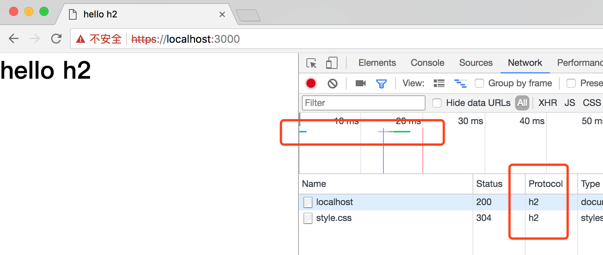

## 理解 HTTP/2

>概念：

 HTTP/2（超文本传输协议第2版，最初命名为HTTP 2.0），
简称为h2（基于TLS/1.2或以上版本的加密连接）或h2c（非加密连接）

> 条件

需要浏览器的支持，目前最新版的 Chrome、Opera、 FireFox、 IE11、 edge 都已经支持了
需要 WEB 服务器的支持，比如 Nginx , H20
如果浏览器或服务器有一方不支持，那么会自动变成 Http/1.1

### 一、http 的发展史

要了解 http2.0 首先就需要了解一下 http 的发展史 ，才能明白 http2.0 是基于什么目的提出的，有什么用

#### 1、HTTP/1.0时代

HTTP1.0规定浏览器与服务器只保持短暂的连接，浏览器的每次请求都需要与服务器建立一个TCP连接，
服务器完成请求处理后立即断开TCP连接，服务器不跟踪每个客户也不记录过去的请求。但这样在每次请求资源的
时候都要重新建立tcp连接，走3次握手的过程，严重影响客户机和服务器的性能。

#### 2、HTTP/1.1时代

为了解决 HTTP1.0 的不足，HTTP1.1做了些改进。

##### （1）、增加了「keep-alive」  功能

浏览器默认开启keep-alive来告知服务器建立一个长连接，当浏览器建立一个 TCP连接时，多个请求都会使用这个连接，这样就避免了重复建立连接带来的性能消耗问题

##### （2）、增加 PipeLining 管道

一个 TCP 连接只能发送一个请求，并且等响应成功才能发送第二个请求。所以  http／1.1 定制了  PipeLining 管道  ，通过这个管道浏览器可以同时发送多个请求给服务器，但服务器的响应也只能一个接一个返回（但各地浏览器都不支持这个管道或默认关闭，若有然并软）

##### 小结：

>介于 HTTP/1.1 的网络特性
所以我们经常做的网页优化有以下方式：
拼接 js ， css  减少http请求
利用雪碧图减少http请求
域名分区，由于浏览器的限制，同一个域下最多只能建立6个连接，所以资源放在多个域名下来突破浏览器的域名限制

#### 3、SPDY 时代

虽然 http/1.1 做了优化，但也扛不住日益丰富的网页，于是 google 推出了一种开放的网络传输协议 SPDY
设计SPDY的目的在于降低网页的加载时间[7]。通过优先级和多路复用，SPDY使得只需要创建一个TCP连接即可传送网页内容及图片等资源
SPDY并不用于取代HTTP，它只是修改了HTTP的请求与应答在网络上传输的方式[1]；这意味着只需增加一个SPDY传输层，现有的所有服务端应用均不用做任何修改。 当使用SPDY的方式传输，HTTP请求会被处理、标记简化和压缩。比如，每一个SPDY端点会持续跟踪每一个在之前的请求中已经发送的HTTP报文头部，从而避免重复发送还未改变的头部。而还未发送的报文的数据部分将在被压缩后被发送。

##### （1）、多路复用 （multiplexing）

通过多个请求 stream 共享一个 tcp 连接

##### （2）、请求优先级

多路复用会带来一个问题，那就是哪些资源先请求能，防止重要资源阻塞呢，那就是有个 优先级的机制，SPDY允许给每个         request设置优先级

##### （3）、header 压缩

SPDY对header的压缩率可以达到80%以上，低带宽环境下效果很大。

> SPDY 现已经被大多数浏览器以及 WEB 服务器所支持，但为了推进 HTTP/2.0, Google 已经宣布在 2016年对其停止开发。

#### 4、HTTP/2.0 时代

终于到了HTTP/2.0时代，HTTP/2是基于Google的SPDY协议为基础开发的新的web协议，所以多大理论差不多

##### （1）、二进制分帧

在应用层和传输层之间加了一个【二进制分帧】，这样就可以在不改动 HTTP方法，状态码，URI等字段的情况下
突破 HTTP／1.1 的性能限制，改进传输性能，实现低延迟，高吞吐量



在二进制分帧层上，HTTP2.0会将所有传输的信息分割为更小的消息和帧,
并对它们采用二进制格式的编码，其中HTTP1.x的首部信息会被封装到Headers帧
，而我们的request body则封装到Data帧里面。

##### （2)、压缩头部

http2.0 规定 客户发和服务端会共同维护`首部表`，对相同的头部只发送一次，不再重复发送，这样能减少头部开销，特别是有轮询操作。
如果头部发生了变化，那只需发送变化了数据在 headers 帧里面 



##### （3)、多路复用

>  在一条连接上同时发送无数个请求




##### （4)、请求优先级

既然所有资源都是并行发送，那么就需要「优先级」的概念了，这样就可以对重要的文件进行先传输，加速页面的渲染。

##### （5)、服务器推送

在 HTTP2.0中，服务器推送是指在客户端请求之前发送数据的机制。

##### （6)、强制 SSL

虽然 HTTP/2.0 协议并没声明一定要用 SSL，但是 Google Chrome 等浏览器强制要求使用 HTTP/2.0 必须要用上 SSL， 也就是说必须要： https://

##### 小结：

还记得上面 HTTP/1.1的小结吗，有了 HTTP/2.0 ，HTTP/1.1 的一些传统网页优化方案将不再适用

>因为“所有的HTTP2.0的请求都在一个TCP链接上”，“资源合并减少请求”，比如CSS Sprites,多个JS文件、CSS文件合并等手段没有效果，或者说没有必要。
 因为“多路复用”，采用“cdn1.cn,cdn2.cn,cdn3.cn，打开多个TCP会话，突破浏览器对同一域名的链接数的限制”的手段是没有必要的。因为因为资源都是并行交错发送，且没有限制，不需要额外的多域名并行下载。
 因为“服务器推送”，内嵌资源的优化手段也变得没有意义了。而且使用服务器推送的资源的方式更加高效，因为客户端还可以缓存起来，甚至可以由不同的页面共享（依旧遵循同源策略）

### 二、使用 node.js 实现 HTTP/2.0 请求

下面利用一个简单的demo来实践一下上面的理论，咱们会用一个 spdy 的node模块来实现 h2 的请求。
HTTP/2虽然支持明文的HTTP传输，但是SPDY强制要求使用HTTPS，所以在实现h2请求我们还需要做一些
准备工作，那就是先生成一个证书实现HTTPS请求，在这基础上才能实现 HTTP/2.0

#### 1、生成自签名的证书

> 生成私钥KEY ， 这一步执行完以后，cert目录下会生成server.key文件

```$xslt
$ openssl genrsa -des3 -out server.key 2048
```
> 生成证书请求文件CSR
```$xslt
$ openssl req -new -key server.key -out server.csr
```
> 生成CA的证书
```$xslt
$ openssl req -new -x509 -key server.key -out ca.crt -days 3650
```
>最后用第3步的CA证书给自己颁发一个证书玩玩
```$xslt
$ openssl x509 -req -days 3650 -in server.csr \
>  -CA ca.crt -CAkey server.key \
>  -CAcreateserial -out server.crt
```

小结一些生成证书流程

SSL 签名证书的生成流程大概如下：
先在本地或自己的服务器生成 server.key   和  server.csr  文件，然后讲 server.csr  文件提交给 数字证书认证机构（英语：Certificate Authority，缩写为CA），然后 CA 估计会对你提交过来的  server.csr  文件进行签名，然后你得到签名过后的
server.csr  文件配合刚才生成的  server.key   就能开启 HTTPS 了
上面第 3 小点，咱们为了测试在本地自己生成 CA 证书，自己给  server.csr  文件签名 ！！！

#### 2、一个 node 服务

```JavaScript
const spdy = require('spdy');
const express = require('express');
const fs = require('fs');

const port = 3000;
const app = express();

app.use(express.static('src'));

//  主页输出 "Hello World"
app.get('/', function (req, res) {
    console.log("主页 GET 请求");
    res.send('Hello GET');
})

//  POST 请求
app.post('/', function (req, res) {
    console.log("主页 POST 请求");
    res.send('Hello POST');
})

//  /del_user 页面响应
app.get('/del_user', function (req, res) {
    console.log("/del_user 响应 DELETE 请求");
    res.send('删除页面');
})

const options = {
    passphrase: '123456', // 我在生成证书的时候密码填写的是 123456
    key: fs.readFileSync(__dirname + '/server.key'),
    cert: fs.readFileSync(__dirname + '/server.crt')
}

spdy.createServer(options, app)
    .listen(port, (error) => {
        if (error) {
            console.error(error)
            return process.exit(1)
        } else {
            console.log('Listening on port: ' + port + '.')
        }
    })
```
启动 node 服务
```$xslt
cd demo
node index.js
> Listening on port: 3000.
```
在浏览器打开 https://localhost:3000/
你会碰到这个页面，点击继续即可


开启 h2

