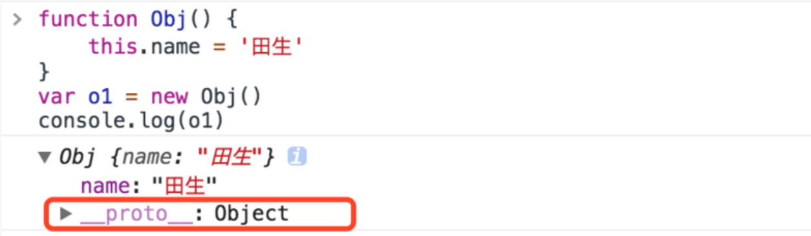

> 声明： 【JavaScript设计模式】 系列 是来自《JavaScript设计模式与开发》这本书的读书笔记，会结合自身的理解和一些项目经验做笔记，原书作者 曾探

### 前言
什么是设计模式，设计模式就是在某种场合下对某个问题的一种解决方案。说通俗一点就是给一段代码起个名字而已，比如一个用玻璃做的能装水的东西，给它起个名字叫`水杯`，
大家一提到`水杯`就知道什么对象，具有什么功能，这样大家一想到要喝水就找个`水杯`这么个东西，满足需求


### 一、面向对象的JavaScript

#### 1、动态类型语言
JavaScript是一门典型的动态类型语言。记住这一特性很重要，比如js有个数组类型Array，要是一个对象，这个对象具有length属性，还拥有slic，splice方法，那也可以将这个对象当做数组来用。这完全是可以的，因为语言是动态的，我们可以面向接口编程，而不是面向实现编程。

#### 2、多态
也正因为js是动态类型语言，所以js本身具有多态的特性。
`什么是多态呢`：多态就是同一操作作用于不同对象，产生不同的结果
例子：
```
function fun(obj) {
    obj.log()
}
function Obj1() {

}
Obj1.prototype.log = function () {
    console.log('....Obj1......')
}
function Obj2() {

}
Obj2.prototype.log = function () {
    console.log('....Obj2......')
}
fun(new Obj1()) // ....Obj1......
fun(new Obj2()) // ....Obj2......
```
给函数 `fun` 传递不同对象，能得到不同的结果
这要是在Java就要设计成子类继承同一个父类，调用的时候向上转型才能调用同一个父类方法得到不同结果，多麻烦呀
JavaScript是一门动态语言，既没有检查创建的对象类型，也没有检查传递的参数类型，所以实现
多态就变得尤为简单，不必诸如向上转型的技术来实现多态

#### 3、封装
JavaScript是没有私有变量和共有变量或共有方法的，但它有个函数作用域，我们可以利用这一特性来满足这一点
例子：
```
var fun2 = (function () {
    var _name = 'my name is 田生'
    return {
        name: _name,
        pubFun: function () {
            console.log('.....pubFun.....')
        }
    }
})()
console.log(fun2.name)    // my name is 田生
console.log(fun2.pubFun()) //.....pubFun.....
```

#### 4、JavaScript中的原型继承
JavaScript的对象不是通过实例化得到的，而是通过克隆原型对象`Object.prototype`得到的。
所以经常会预定一个面试题是，js 的 new 操作做了哪些工作？那你可以这样回答，new 操作符是
执行一个构造函数，函数里面克隆了 `Object.prototype` 对象，并把新对象附上属性值返回出去。
例子：
```
function Obj() {
    this.name = '田生'
}
var o1 = new Obj()
console.log(o1.name) // 田生
// 相当于
function CloneObj() {
    var obj = new Object() // 从 `Object.prototype` 克隆一个新对象
    obj.name = '田生'
    return obj
}
var o2 = CloneObj()
console.log(o2.name)  // 田生
```

#### 5、JavaScript中的原型琏
如果对象无法响应某个请求时，它会把这个请求委托给它的构造器的原型`prototype`去执行
例子：
```
function Obj() {
    this.name = '田生'
}
var o1 = new Obj()
console.log(o1.toString()) // [object Object]
console.log(o1)
```
上面例子克隆了个新的 `对象Obj` ，新对象没有 `toString` 方法，所以在调用 `toString` 方法时，这个请求就会委托给他的原型对象 `Object` 的 `prototype`去执行
那你可能会疑惑，对象 `Obj对象` 是怎么和 `Object` 的 `prototype对象`挂上钩的呢？
你可以试着在Chrome浏览器的开发者模式中输入上面代码，试着打印 `console.log(o1)`
会发现 `Obj` 有个 __proto__ 的属性指向了 `Object`对象，这就是它们连接的纽带





### 二、this、call 和 apply

#### 1、this
> 当函数作为对象的方法调用时，this 指向改对象
例子：
```
var Obj = {
    name: '田生',
    fun: function () {
        console.log(this.name)  // this 指向改 对象
    }
}
Obj.fun()  //  田生
```
> 当函数不作为对象的属性被调用时，也就是常说的普通方法，此时this指向全局对象
```
var name = '田生....2'
function fun1() {
    console.log(this.name) // fun1 当做普通函数，this指向全局
    function fun2() {
        console.log(this.name)  // fun2 也当做普通函数，this指向全局
    }
    fun2() // '田生....2'
}
fun1() // '田生....2'
```
fun2 函数的this为什么也指向全局呢？有必要再强调一下，当函数不作为对象的属性被调用时，也就是常说的普通方法，此时this指向全局对象！
当然在 ES6 strict 模式下 this为undefined

#### 2、call 和 apply
首先要明确一点，JavaScript 的 Function 实际上是功能完整的对象。那对象就可以调用方法。
所以在看到下面的例子就不要疑惑：
```
function fun(para) {
}
fun.length
fun.apply(null, ['田生'])
fun.call(null, '田生')
fun.toString()
```
为什么一个函数有属性呢，为什么一个函数居然可以调用另一个方法呢，因为JavaScript 的 Function 实际上是功能完整的对象啊，对象就有属性和方法啊

##### (1)、call 和 apply 的区别
没啥区别，就接受参数的方式不一样而已，apply 接受的第二个参数是集合，call接受的参数不固定用逗号隔开。
但可以说 call 是包装在 apply 的语法糖，内部实现也是将参数转数组的形式，所以某种意义上讲
apply的效率高一点。

##### (2)、call 和 apply 的用途
> 改变this的指向：
```
function Obj() {
  this.name = 'HI 田生~'
  function fun() {
      console.log(this.name) // undefined
  }
  fun()
}
new Obj()
```
上面小节也讲了，fun 没绑定到对象上，所以在这里被当做普通函数使用，this指向全局对象，那咱们要
this.name正常输出怎么办：
```
// 方法一：传统的 _this 传递
function Obj() {
  this.name = 'HI 田生~'
  var _this = this
  function fun() {
      console.log(_this.name) // HI 田生~
  }
  fun()
}
new Obj()

// 方法二：借助 apply 或 call
function Obj() {
  this.name = 'HI 田生~'
  function fun() {
      console.log(this.name) // HI 田生~
  }
  fun.apply(this)
}
new Obj()
```
哪种方法好用我就不多说了

> 借用其他对象方法
```
var arr = []
Array.prototype.push.apply(arr,[1, 2, 3])
console.log(arr)  // [1, 2, 3]
```


### 三、闭包和高阶函数

#### 1、闭包
闭包这个概论总是不好理解，你可以简单的理解为 `闭包就是能够读取其他函数内部变量的函数`
例子:
```
var func = function () {
    var a= 1
    return function () {
        a++
        console.log(a)
    }
}
var fun = func()
fun() // 2
fun() // 3
fun() // 4
```
变量 a 是函数 func 的局部变量，外部函数或对象无法访问，但 func 内部的匿名函数能访问，那就这个匿名函数就是一个`闭包` ，将闭包返回出去，相当于将访问权给了外部环境，外部环境就可以访问一个函数的
局部变量了。

#### 2、闭包的作用
上面第一小点顺带讲了闭包能使外部环境访问局部变量，是作用点之一。闭包还可以`延续局部变量的寿命`
例子：
```
// 方式1
var report = function (src) {
    var img = new Image()
    img.src = src
}
report('http://wwww.tiansheng.logo.png')

// 方式2
var report = (function () {
    var img
    return function (src) {
        img = new Image()
        img.src = src
    }
})()
report('http://wwww.tiansheng.logo.png')
```
利用方式1有可能图片还没加载完数据就丢失了，因为 report 方法执行完局部变量就销毁了，而方法2
利用闭包的方式延长了变量的寿命

#### 3、高阶函数
高阶函数至少需要满足以下条件之一：
- 函数可以作为参数传递
- 函数可以作为返回值输出

我们经常写的带有对调函数就是一个高阶函数
例子：
```
/**
 * 高阶函数
 * @param name
 * @param callBack
 */
function fun(name, callBack) {
    // do something ...
    callBack()
}
```
函数作为返回值输出，其实就是一种闭包的表现
下面一个单例模式的例子：
```
var getSingle = function (fn) {
    var ret;
    return function () {
        return ret || (ret = fn.apply(this, arguments))
    }
}

var getScript = getSingle(function () {
    // ...
})
var script1 = getScript()
var script2 = getScript()
console.log(script1 === script2) // true
```

### 小结：
本小结写了  【面向对象的JavaScript】、【this、call 和 apply】、  【闭包和高阶函数】 ，为接下去的JavaScript 设计模式做铺垫
